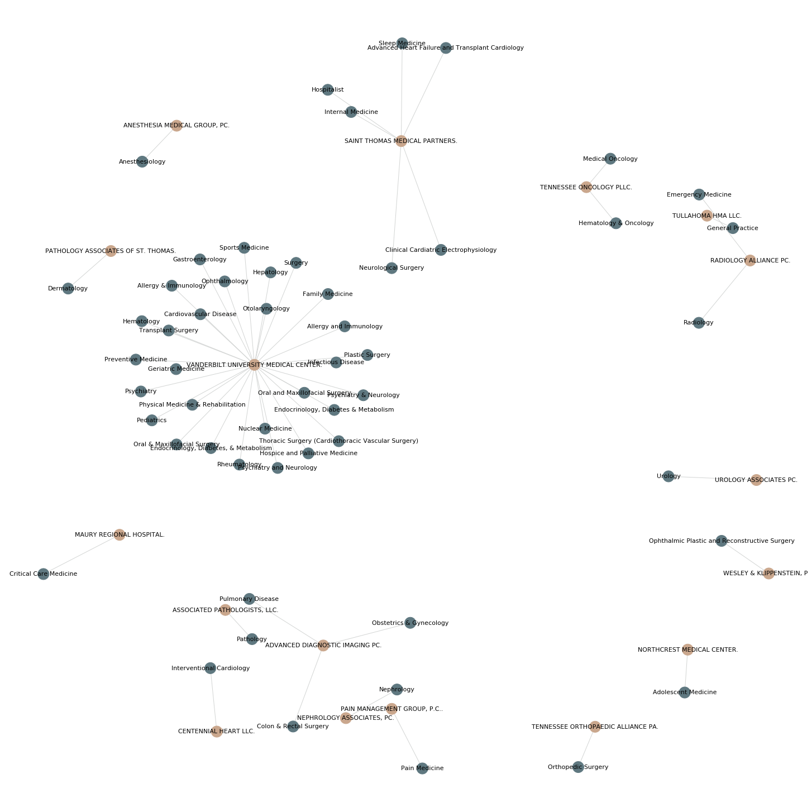

### #Healthcare - the analysis of the specialty referrals across the United States
#### Data questions:
* Within a local CBSA, show which hospitals specialists typically refer patients to
* Analyze how facility type referrals differ by specialty (e.g. Do orthopedists refer to different types of facilities than cardiologists?)
#### Data source: 
* DocGraph Hop Teaming Dataset (the 2017 Free version): https://careset.com/datasets/

* The NPPES Data Dissemination Full Replacement Monthly NPI File (the big one): https://download.cms.gov/nppes/NPI_Files.html

* The December 2019 POS CLIA CSV File and Layouts:
https://www.cms.gov/Research-Statistics-Data-and-Systems/Downloadable-Public-Use-Files/Provider-of-Services/
#### Screenshots
* question 1:

* question 2:

